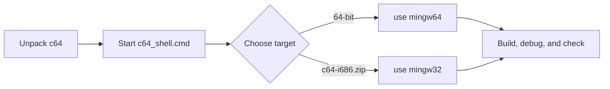

# c64: Portable C and C++ Development Environment for Windows


> **c64 — the C64 fullerene-inspired fusion environment: Ultra-Light Build, Seamless Shell, POSIX Core.**

c64 is a small, self-contained development environment for building C and C++
applications on Windows. Inspired by the C64 fullerene structure, it combines
high-cohesion components with low-coupling boundaries: the toolchain, shell,
and optional extensions work together while remaining portable and replaceable.
It is built from source by the included Dockerfile, then distributed as a
`.zip` file that can be unpacked and used anywhere.

Why c64:

* **No installation or administrator access.** Unpack it, use it, and delete
  it when it is no longer needed.
* **Offline by default.** Using the development kit never requires or attempts
  an internet connection.
* **Portable, static runtime components.** x64 and x86 MinGW toolchains are
  selected independently for each CMD session.
* **Modern Clang environment.** An independent clang64 distribution provides
  Clang, LLD, LLVM tools, and a UCRT-based MinGW-w64 sysroot for modern
  Windows development.
* **Windows XP option.** The separate i686 distribution is built for 32-bit
  Windows XP compatibility.
* **Buildable and adaptable.** The complete toolchain and its customizations
  are built from source in a clean, repeatable environment.

Included tools:

* [Mingw-w64 GCC][w64] : compilers, linker, assembler
* [GDB][gdb] : debugger
* [GNU Make][make] : standard build tool
* [CMake][cmake] with [Ninja][ninja] : build system
* [busybox-w32][bb] : standard unix utilities, including sh
* [Vim][vim] : powerful text editor
* [Universal Ctags][ctags] : source navigation
* [NASM][nasm] : x86 assembler
* [Cppcheck][cppcheck] : static code analysis
* [Ccache][ccache] : compiler cache

The toolchain includes pthreads, C++11 threads, and OpenMP. All included
runtime components are static. **Docker or Podman is not required to use the
development kit**; it is only needed to build the kit itself.

## Quick start

After unpacking a c64 distribution, start the CMD + Clink environment from
the installation root:

  c64_shell.cmd /unicode

Select a target toolchain. Most users will want 64-bit Windows:

  use mingw64

Create `hello.c`:

```c
#include <stdio.h>

int main(void)
{
  puts("Hello, c64!");
}
```

Then build and run it:

  gcc -Wall -Wextra -O2 hello.c -o hello.exe
  hello.exe

The `c64-i686.zip` distribution provides `use mingw32` for 32-bit targets;
the default `c64.zip` distribution provides `use mingw64`. Run `use list` to
see the available session helpers. The next section explains the two supplied
shell environments and their configuration in more detail.

### Windows XP compatibility

`c64-i686.zip` is the 32-bit, Windows XP-compatible edition. Its toolchain
defaults to the Windows XP API baseline and Pentium 4 CPU architecture, so
programs built with `use mingw32` can target Windows XP without adding those
options manually. Use this distribution when the compiler itself or the
program being built must run on 32-bit Windows XP.

This is a toolchain baseline, not a guarantee for every program: your source,
third-party libraries, and runtime behavior must also avoid APIs unavailable
on XP. Test the final program on the oldest Windows version you support.

On 64-bit Windows, download the matching `c64-i686.zip` release and merge only
its `c64/mingw32/` directory into an unpacked `c64.zip` installation to make
both targets available. See [The `use` command](docs/use-command.md).

## Documentation

Use the [English documentation](docs/README.md) to learn c64 by task. Every
guide has a paired [Chinese version](docs/README_zh.md). The Chinese homepage
is [README_zh](README_zh.md).

Start with [Getting started](docs/getting-started.md), then see [Toolchains](docs/toolchains.md),
[Directory layout](docs/directory-layout.md), [The `use` command](docs/use-command.md),
and [Personalization](docs/personalization.md) for the core c64 workflow.



## Build the distribution

First build the image, then run it to produce a distribution .zip file:

    docker build -t c64 .
    docker run --rm c64 >c64.zip

This takes about half an hour on modern systems. You will need an internet
connection during the first few minutes of the build. Run the second command
from `cmd.exe`, Git Bash, or WSL rather than PowerShell, whose text-oriented
redirection is unsuitable for this binary archive output.

## Runtime environments

The final .zip file contains tools in a typical unix-like configuration.
Unzip the contents anywhere. `c64.exe` is a self-contained launcher for a
BusyBox `sh -l` login shell. It requires no system changes and does not load
CMD startup scripts. It sets `C64_HOME` to the installation root,
`C64_VERSION` to the release version, and `C64_VIM_HOME` to the Vim directory.

For the CMD + Clink environment, start `c64_shell.cmd`, or add the `bin/`
directory to your path. For example, inside a `cmd.exe` console or batch script:

    set PATH=c:\path\to\c64\bin;%PATH%

  Then explicitly enable a target and, if desired, start an interactive unix
  shell:

    use mingw64
    sh -l

  Windows Terminal should start c64 through the root `c64_shell.cmd` launcher.
  Set its command line to:

    C:\path\to\c64\c64_shell.cmd /unicode

  The optional `/unicode` switch sets CMD's active code page to UTF-8 before
  the c64 session is initialized. The root `c64_shell.cmd` is a user-facing
  launcher for Windows Terminal, shortcuts, and Explorer, analogous to MSYS2's
  `msys2_shell.cmd`. It calls the internal `lib\c64\init.cmd` script.

### Configuration

The `etc\` directory contains the user-editable CMD, Clink, alias, and shell
configuration. Each supplied configuration has a matching factory template in
`etc\default\`. Delete an active configuration file to restore its default at
the next `c64_shell.cmd` startup.

## Compiler cache

After selecting a target, `use ccache` transparently and
automatically caches GCC builds in Ccache:

  use mingw64
  use ccache

  Or use `ccache`, `ccache-gcc`, or `ccache-g++` directly.

## Optimized for size

Runtime components are optimized for size, leading to smaller application
executables. Unique to c64, `libmemory.a` is a library of `memset`,
`memcpy`, `memmove`, `memcmp`, and `strlen` implemented as x86 string
instructions. When [not linking a CRT][crt], linking `-lmemory` provides
tiny definitions, particularly when GCC requires them.

Also unique to c64, `libchkstk.a` has a leaner, faster definition of
`___chkstk_ms` than GCC (`-lgcc`), as well as `__chkstk`, sometimes needed
when linking MSVC artifacts. Both are in the public domain and so, unlike
default implementations, do not involve complex licensing. When required
in a `-nostdlib` build, link `-lchkstk`.

## Fortran support

Only C and C++ are included by default, but c64 also has full
support for Fortran. To build a Fortran compiler, add `fortran` to the
`--enable-languages` lines in the Dockerfile.

## Recommended downloadable, offline documentation

With a few exceptions, such as Vim's built-in documentation (`:help`), c64
does not include documentation. However, you need not forgo offline
documentation alongside your offline development tools. This is a list of
recommended, no-cost, downloadable documentation complementing c64's
capabilities. In rough order of importance:

* [cppreference][doc-cpp] (HTML), friendly documentation for the C and C++
  standard libraries.

* [GCC manuals][doc-gcc] (PDF, HTML), to reference GCC features,
  especially built-ins, intrinsics, and command line switches.

* [Win32 Help File][doc-win32] (CHM) is old, but official, Windows API
  documentation. Unfortunately much is missing, such as Winsock. (Offline
  Windows documentation has always been very hard to come by.)

* [C and C++ Standards (drafts)][doc-std] (PDF), for figuring out how
  corner cases are intended to work.

* [Intel Intrinsics Guide][doc-intr] (interactive HTML), a great resource
  when working with SIMD intrinsics. (Search for "Download" on the left.)

* [GNU Make manual][doc-make] (PDF, HTML)

* [GNU Binutils manuals][doc-ld] (PDF, HTML), particularly `ld` and `as`.

* [GDB manual][doc-gdb] (PDF)

* [BusyBox man pages][doc-bb] (TXT), though everything here is also
  available via `-h` option inside c64.

* [NASM manual][doc-nasm] (PDF)

* [Intel Software Developer Manuals][doc-intel] (PDF), for referencing x86
  instructions, when either studying compiler output with `objdump`, or
  writing assembly with `nasm` or `as`.

## Library installation

Except for the standard libraries and Win32 import libraries, c64
does not include libraries, but you can install additional libraries such
that the toolchain can find them naturally. There are three options:

1. Install it under the selected distribution's target sysroot at
  `c64/mingw64/x86_64-w64-mingw32/` or `c64/mingw32/i686-w64-mingw32/`.
  The easiest option, but it will require re-installation after upgrading c64. If it
   defines `.pc` files, the `pkg-config` command will automatically find
   and use them.

2. Append its installation directory to your `CPATH` and `LIBRARY_PATH`
   environment variables. Use `;` to delimit directories. You would likely
   do this in your `.profile`.

3. If it exists, append its `pkgconfig` directory to the `PKG_CONFIG_PATH`
   environment variable, then use the `pkg-config` command as usual. Use
   `;` to delimit directories

Both (1) and (3) are designed to work correctly even if c64 or the
libraries have paths containing spaces.

## Cppcheck tips

Use `--library=windows` for programs calling the Win32 API directly, which
adds additional checks. In general, the following configuration is a good
default for programs developed using c64:

    $ cppcheck --quiet -j$(nproc) --library=windows \
               --suppress=uninitvar --enable=portability,performance .

A "strict" check that is more thorough, but more false positives:

    $ cppcheck --quiet -j$(nproc) --library=windows \
          --enable=portability,performance,style \
          --suppress=uninitvar --suppress=unusedStructMember \
          --suppress=constVariable --suppress=shadowVariable \
          --suppress=variableScope --suppress=constParameter \
          --suppress=shadowArgument --suppress=knownConditionTrueFalse .

## Notes

`$HOME` can be set through the adjacent `c64.ini` configuration, and may
even be relative to the `c64/` directory. This is useful for
encapsulating the entire development environment, with home directory, on
removable, even read-only, media. Use a `.profile` in the home directory
to configure the environment further.

I'd love to include Git, but unfortunately Git's build system doesn't
quite support cross-compilation. A decent alternative would be
[Quilt][quilt], but it's written in Bash and Perl.

Neither Address Sanitizer (ASan) nor Thread Sanitizer (TSan) [has been
ported to Mingw-w64][san] ([also][san2]), but Undefined Behavior Sanitizer
(UBSan) works perfectly under GDB. With both `-fsanitize=undefined` and
`-fsanitize-trap`, GDB will [break precisely][break] on undefined
behavior, and it does not require linking with libsanitizer.

The kit includes a unique [`debugbreak` command][debugbreak]. It causes
all debugee processes to break in the debugger, like using Windows' F12
debugger hotkey. This is especially useful for console subsystem programs.

The `vc++filt` command, unique to c64, works just like `c++filt` but
processes [Visual C++ name decorations][names] instead. It's useful when
examining GCC-incompatible libraries, potentially to make some use of them
anyway.

The `peports` command displays export and import tables of EXEs and DLLs. It
is similar to MSVC `dumpbin` options `/exports` and `/imports`, but is more
focused. Pipe its output through `c++filt` or `vc++filt` when inspecting C++
symbols.

Since the build environment is so stable and predicable, it would be
great for the .zip to be reproducible, i.e. builds by different people
are bit-for-bit identical. There are multiple reasons why this is not
currently the case, the least of which are [timestamps in the .zip
file][zip].

## Licenses

When distributing binaries built using c64, your .exe will include
parts of this distribution. For the GCC runtime, including OpenMP, you're
covered by the [GCC Runtime Library Exception][gpl] so you do not need to
do anything. However the Mingw-w64 runtime [has the usual software license
headaches][bs] and you may need to comply with various BSD-style licenses
depending on the functionality used by your program: [MinGW-w64 runtime
licensing][lic1] and [winpthreads license][lic2]. To make this easy,
c64 includes the concatenated set of all licenses in the file
`COPYING.MinGW-w64-runtime.txt`, which should be distributed with your
binaries.


[bb]: https://frippery.org/busybox/
[break]: https://nullprogram.com/blog/2022/06/26/
[bs]: https://www.rdegges.com/2016/i-dont-give-a-shit-about-licensing/
[ccache]: https://ccache.dev/
[cmake]: https://cmake.org/
[cppcheck]: https://cppcheck.sourceforge.io/
[crt]: https://nullprogram.com/blog/2023/02/15/
[ctags]: https://github.com/universal-ctags/ctags
[debugbreak]: https://nullprogram.com/blog/2022/07/31/
[doc-bb]: https://busybox.net/downloads/BusyBox.txt
[doc-cpp]: https://en.cppreference.com/w/Cppreference:Archives
[doc-gcc]: https://gcc.gnu.org/onlinedocs/
[doc-gdb]: https://sourceware.org/gdb/current/onlinedocs/gdb.pdf
[doc-intel]: https://software.intel.com/content/www/us/en/develop/articles/intel-sdm.html
[doc-intr]: https://software.intel.com/sites/landingpage/IntrinsicsGuide/
[doc-ld]: https://sourceware.org/binutils/docs/
[doc-make]: https://www.gnu.org/software/make/manual/
[doc-nasm]: https://www.nasm.us/docs.php
[doc-std]: https://stackoverflow.com/a/83763
[doc-win32]: https://web.archive.org/web/20220922051031/http://www.laurencejackson.com/win32/
[gdb]: https://www.gnu.org/software/gdb/
[go]: https://nullprogram.com/blog/2021/06/29/
[gpl]: https://www.gnu.org/licenses/gcc-exception-3.1.en.html
[lic1]: https://sourceforge.net/p/mingw-w64/mingw-w64/ci/master/tree/COPYING.MinGW-w64-runtime/COPYING.MinGW-w64-runtime.txt
[lic2]: https://sourceforge.net/p/mingw-w64/mingw-w64/ci/master/tree/mingw-w64-libraries/winpthreads/COPYING
[make]: https://www.gnu.org/software/make/
[names]: https://learn.microsoft.com/en-us/cpp/build/reference/decorated-names
[nasm]: https://www.nasm.us/
[ninja]: https://ninja-build.org/
[quilt]: http://savannah.nongnu.org/projects/quilt
[san]: http://mingw-w64.org/doku.php/contribute#sanitizers_asan_tsan_usan
[san2]: https://groups.google.com/forum/#!topic/address-sanitizer/q0e5EBVKZT4
[vim]: https://www.vim.org/
[w64]: http://mingw-w64.org/
[zip]: https://tanzu.vmware.com/content/blog/barriers-to-deterministic-reproducible-zip-files
