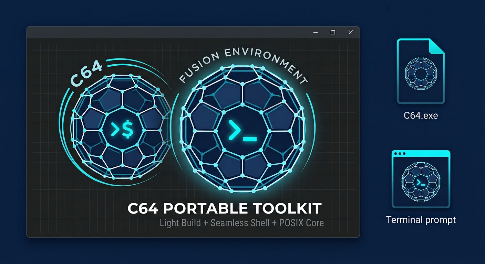
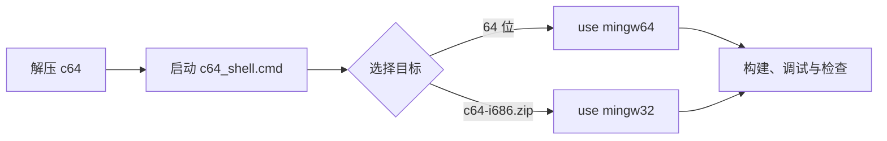

# c64：Windows 便携式 C/C++ 开发环境

> **c64 —— 以 C64 富勒烯为灵感的融合环境：Ultra-Light Build、Seamless Shell、POSIX Core。**

[English](README.md)

c64 是一套小巧、独立的 Windows C/C++ 开发环境。它以 C64 富勒烯分子结构为
灵感：工具链、shell 与可选扩展在各自高内聚、边界低耦合的前提下协同工作，因而
保持便携且可替换。它通过仓库中的 Dockerfile 从源码构建，再以可在任意位置解压
使用的 `.zip` 形式分发。

## 为什么使用 c64

* **免安装、免管理员权限。** 解压即可使用，不再需要时直接删除。
* **默认离线。** 使用开发环境时不会要求或尝试访问互联网。
* **便携的静态运行时组件。** x64 与 x86 MinGW 工具链可按每个 CMD 会话独立选择。
* **可选 Windows XP 支持。** 独立的 i686 发行包按 32 位 Windows XP 兼容性构建。
* **可构建、可定制。** 全部工具链与定制均可在干净、可重复的环境中从源码构建。

内置 MinGW-w64 GCC、GDB、Make、CMake、Ninja、BusyBox、Vim、Universal Ctags、NASM、Cppcheck 与 Ccache。工具链还包括 pthreads、C++11 线程和 OpenMP。

## 快速开始

解压 c64 后，在安装根目录启动 CMD + Clink 环境：

    c64_shell.cmd /unicode

`/unicode` 为可选参数，会在初始化前将 CMD 代码页设为 UTF-8。选择常用的 64 位目标：

    use mingw64

创建 `hello.c`：

编译并运行：

    gcc -Wall -Wextra -O2 hello.c -o hello.exe
    hello.exe

`c64-i686.zip` 发行包提供用于构建 32 位程序的 `use mingw32`；默认的
`c64.zip` 发行包提供 `use mingw64`。使用 `use list` 查看可用的会话助手。

### Windows XP 兼容性

`c64-i686.zip` 是面向 32 位 Windows XP 的兼容发行版。其工具链默认使用
Windows XP API 基线和 Pentium 4 CPU 架构，因此通过 `use mingw32` 构建的
程序无需手动添加这些选项即可面向 Windows XP。需要让编译器本身或构建产物
运行在 32 位 Windows XP 时，请使用该发行包。

这只是工具链基线，并不能保证任意程序都兼容 XP：源码、第三方库和运行时行为
同样必须避免使用 XP 不支持的 API。应在所支持的最旧 Windows 版本上测试最终程序。

在 64 位 Windows 上，可下载相同版本的 `c64-i686.zip`，仅将其
`c64/mingw32/` 目录合并到已解压的 `c64.zip` 安装目录，从而同时使用两种目标。详见
[`use` 命令](docs/use-command_zh.md)。

## 文档导航

按任务阅读完整的中文 [c64 文档](docs/README_zh.md)。每篇中文文档都有文件名相对应的英文版本。

| 目标 | 文档 |
| --- | --- |
| 解压、启动并编译第一个程序 | [快速开始](docs/getting-started_zh.md) |
| 了解解压后的 c64 发行包 | [目录结构](docs/directory-layout_zh.md) |
| 选择工具链并添加会话组件 | [`use` 命令](docs/use-command_zh.md) |
| 用 GCC、Make、CMake 和 Ninja 构建项目 | [构建项目](docs/building-projects_zh.md) |
| 使用 GDB、UBSan 和 `debugbreak` 调试 | [调试](docs/debugging_zh.md) |
| 定制 shell、别名、提示符和主目录 | [配置](docs/configuration_zh.md) |
| 将 c64 打造成自己的开发环境 | [个性化](docs/personalization_zh.md) |

## 构建发行包

Docker 或 Podman 仅用于构建 c64，本身并非运行时要求。构建镜像并导出 `.zip`：

    docker build -t c64 .
    docker run --rm c64 >c64.zip

构建通常约需半小时，开始时需要互联网下载源码。第二条命令应在 `cmd.exe`、Git Bash 或 WSL 中执行，不应使用 PowerShell 重定向二进制 ZIP 输出。

### 实验性 clang64 发行包

`multibuild.sh -c` 会构建 `c64-clang64.zip`。这是面向 Windows 10 及更高版本的实验性
64 位工具链，通过 `use clang64` 选择。它包含 Clang、LLD、LLVM binutils 工具，以及基于
UCRT 的 MinGW-w64 sysroot。GCC 仅用于构建发行包，不会作为用户可调用的编译器包含在最终归档中。

    ./multibuild.sh -c

clang64 使用 UCRT runtime；不要在 object file 或 static library 边界将它与默认 mingw64
发行包的 MSVCRT runtime 混用。

## 运行环境

最终的 `.zip` 文件以典型的类 Unix 配置包含全部工具。可解压到任意位置。`c64.exe` 是一个独立启动器，用于启动 BusyBox `sh -l` 登录 shell；无需修改系统，也不会加载 CMD 启动脚本。它将 `C64_HOME` 设为安装根目录、`C64_VERSION` 设为发行版本、`C64_VIM_HOME` 设为 Vim 目录。

如需 CMD + Clink 环境，可启动 `c64_shell.cmd`，或将 `bin/` 目录加入路径。例如，在 `cmd.exe` 控制台或批处理脚本中：

    set PATH=c:\path\to\c64\bin;%PATH%

然后显式启用目标；如有需要，启动交互式 Unix shell：

    use mingw64
    sh -l

Windows Terminal 应通过根目录的 `c64_shell.cmd` 启动 c64。其命令行应设为：

    C:\path\to\c64\c64_shell.cmd /unicode

可选的 `/unicode` 会在 c64 会话初始化前将 CMD 活动代码页切换为 UTF-8。根目录的 `c64_shell.cmd` 是面向 Windows Terminal、快捷方式和资源管理器的启动器，作用类似 MSYS2 的 `msys2_shell.cmd`；它会调用内部的 `lib\c64\init.cmd` 脚本。

### 配置

`etc\` 目录包含用户可编辑的 CMD、Clink、别名及 shell 配置。每份配置在 `etc\default\` 中都有相应的出厂模板。删除正在使用的配置文件后，下次启动 `c64_shell.cmd` 会恢复对应默认值。

## 编译缓存

选择目标后，`use ccache` 会透明且自动地通过 Ccache 缓存 GCC 构建：

    use mingw64
    use ccache

也可以直接使用 `ccache`、`ccache-gcc` 或 `ccache-g++`。

## 尺寸优化

运行时组件针对体积优化，从而生成更小的应用程序可执行文件。c64 特有的 `libmemory.a` 提供了以 x86 字符串指令实现的 `memset`、`memcpy`、`memmove`、`memcmp` 与 `strlen`。当[不链接 CRT][crt]时，链接 `-lmemory` 可获得极小的定义，尤其适用于 GCC 要求这些函数的情形。

c64 特有的 `libchkstk.a` 还提供比 GCC（`-lgcc`）更精简、更快的 `___chkstk_ms` 定义，以及在链接 MSVC 产物时有时需要的 `__chkstk`。二者均属于公有领域，因此不像默认实现那样涉及复杂的许可问题。在需要时，可于 `-nostdlib` 构建中链接 `-lchkstk`。

## Fortran 支持

默认仅包含 C 和 C++，但 c64 也完整支持 Fortran。要构建 Fortran 编译器，请在 Dockerfile 的 `--enable-languages` 行中加入 `fortran`。

## 推荐下载的离线文档

除少数例外（如 Vim 内置的 `:help`）外，c64 不包含文档。不过离线开发工具不代表必须放弃离线资料。以下免费、可下载的资料可补充 c64 的能力，按大致重要性排列：

* [cppreference][doc-cpp]（HTML）：易读的 C 与 C++ 标准库文档。
* [GCC 手册][doc-gcc]（PDF、HTML）：查阅 GCC 特性，尤其是内建函数、intrinsic 与命令行选项。
* [Win32 Help File][doc-win32]（CHM）：较旧但官方的 Windows API 文档；遗憾的是缺少 Winsock 等大量内容。离线 Windows 文档一直很难获取。
* [C 与 C++ 标准草案][doc-std]（PDF）：用于确认边界情况的预期行为。
* [Intel Intrinsics Guide][doc-intr]（交互式 HTML）：编写 SIMD intrinsic 时很有帮助；在左侧查找“Download”。
* [GNU Make 手册][doc-make]（PDF、HTML）。
* [GNU Binutils 手册][doc-ld]（PDF、HTML），尤其是 `ld` 和 `as`。
* [GDB 手册][doc-gdb]（PDF）。
* [BusyBox man pages][doc-bb]（TXT）；其中的内容也可在 c64 内通过 `-h` 选项查看。
* [NASM 手册][doc-nasm]（PDF）。
* [Intel Software Developer Manuals][doc-intel]（PDF）：使用 `objdump` 研究编译器输出，或使用 `nasm`、`as` 编写汇编时，可查阅 x86 指令。

## 安装库

除标准库和 Win32 导入库之外，c64 不包含其他库；但可以按工具链能自然查找的方式安装额外库。有三种选择：

1. 安装到所选发行包目标的 sysroot：`c64/mingw64/x86_64-w64-mingw32/` 或 `c64/mingw32/i686-w64-mingw32/`。这是最简单的方式，但升级 c64 后需要重新安装。若库定义了 `.pc` 文件，`pkg-config` 会自动找到并使用它们。

2. 将安装目录追加至 `CPATH` 和 `LIBRARY_PATH` 环境变量。目录之间使用 `;` 分隔；通常可将其写入 `.profile`。

3. 若存在 `pkgconfig` 目录，将其追加至 `PKG_CONFIG_PATH` 环境变量，之后照常使用 `pkg-config`。目录之间使用 `;` 分隔。

即使 c64 或库的路径中包含空格，第 1 种和第 3 种方式也经过设计，可正确工作。

## Cppcheck 建议

直接调用 Win32 API 的程序应使用 `--library=windows`，以启用额外检查。通常，下列配置适合作为使用 c64 开发程序的默认值：

    $ cppcheck --quiet -j$(nproc) --library=windows \
               --suppress=uninitvar --enable=portability,performance .

更严格、检查更全面但误报也更多的配置：

    $ cppcheck --quiet -j$(nproc) --library=windows \
          --enable=portability,performance,style \
          --suppress=uninitvar --suppress=unusedStructMember \
          --suppress=constVariable --suppress=shadowVariable \
          --suppress=variableScope --suppress=constParameter \
          --suppress=shadowArgument --suppress=knownConditionTrueFalse .

## 说明

可通过相邻的 `c64.ini` 配置 `$HOME`，其路径甚至可相对于 `c64/` 目录。这有利于将完整开发环境及其主目录封装在可移动、甚至只读的介质中。可用主目录中的 `.profile` 进一步配置环境。

很希望能包含 Git，但 Git 的构建系统并不很好地支持交叉编译。一个尚可的替代方案是 [Quilt][quilt]，但它由 Bash 和 Perl 编写。

Address Sanitizer（ASan）和 Thread Sanitizer（TSan）均[尚未移植到 MinGW-w64][san]（[另见][san2]）；但 Undefined Behavior Sanitizer（UBSan）可完美配合 GDB 使用。同时使用 `-fsanitize=undefined` 和 `-fsanitize-trap` 时，GDB 会在未定义行为处[精确中断][break]，且不需要链接 libsanitizer。

本工具包包含独有的 [`debugbreak` 命令][debugbreak]。它会让全部被调试进程在调试器中中断，类似 Windows 的 F12 调试热键；这对控制台子系统程序尤其有用。

c64 独有的 `vc++filt` 命令与 `c++filt` 类似，但处理 [Visual C++ 名称修饰][names]。检查与 GCC 不兼容的库、并尝试加以利用时，它会很有帮助。

`peports` 命令显示 EXE 和 DLL 的导出表及导入表。它类似 MSVC `dumpbin` 的 `/exports` 与 `/imports` 选项，但目标更专一。检查 C++ 符号时，可将其输出传给 `c++filt` 或 `vc++filt`。

构建环境很稳定且可预测，因此理想情况下 `.zip` 应当可复现，即不同用户的构建结果逐位相同。但目前有多项原因使其无法达到这一点，其中最不重要的一项是 `.zip` 文件中的[时间戳][zip]。

## 许可证

分发使用 c64 构建的二进制文件时，生成的 `.exe` 会包含本发行版的部分组件。对于包括 OpenMP 在内的 GCC 运行时，[GCC Runtime Library Exception][gpl] 已涵盖相关情况，无需额外操作。但 MinGW-w64 运行时有常见的软件许可问题，具体取决于程序使用的功能，可能需要遵守各类 BSD 风格许可证：[MinGW-w64 runtime licensing][lic1] 与 [winpthreads license][lic2]。为便于处理，c64 在 `COPYING.MinGW-w64-runtime.txt` 文件中包含全部许可证的拼接集合；分发二进制文件时应一并提供。

[bb]: https://frippery.org/busybox/
[break]: https://nullprogram.com/blog/2022/06/26/
[bs]: https://www.rdegges.com/2016/i-dont-give-a-shit-about-licensing/
[ccache]: https://ccache.dev/
[cmake]: https://cmake.org/
[cppcheck]: https://cppcheck.sourceforge.io/
[crt]: https://nullprogram.com/blog/2023/02/15/
[ctags]: https://github.com/universal-ctags/ctags
[debugbreak]: https://nullprogram.com/blog/2022/07/31/
[doc-bb]: https://busybox.net/downloads/BusyBox.txt
[doc-cpp]: https://en.cppreference.com/w/Cppreference:Archives
[doc-gcc]: https://gcc.gnu.org/onlinedocs/
[doc-gdb]: https://sourceware.org/gdb/current/onlinedocs/gdb.pdf
[doc-intel]: https://software.intel.com/content/www/us/en/develop/articles/intel-sdm.html
[doc-intr]: https://software.intel.com/sites/landingpage/IntrinsicsGuide/
[doc-ld]: https://sourceware.org/binutils/docs/
[doc-make]: https://www.gnu.org/software/make/manual/
[doc-nasm]: https://www.nasm.us/docs.php
[doc-std]: https://stackoverflow.com/a/83763
[doc-win32]: https://web.archive.org/web/20220922051031/http://www.laurencejackson.com/win32/
[gdb]: https://www.gnu.org/software/gdb/
[gpl]: https://www.gnu.org/licenses/gcc-exception-3.1.en.html
[lic1]: https://sourceforge.net/p/mingw-w64/mingw-w64/ci/master/tree/COPYING.MinGW-w64-runtime/COPYING.MinGW-w64-runtime.txt
[lic2]: https://sourceforge.net/p/mingw-w64/mingw-w64/ci/master/tree/mingw-w64-libraries/winpthreads/COPYING
[make]: https://www.gnu.org/software/make/
[names]: https://learn.microsoft.com/en-us/cpp/build/reference/decorated-names
[nasm]: https://www.nasm.us/
[ninja]: https://ninja-build.org/
[quilt]: http://savannah.nongnu.org/projects/quilt
[san]: http://mingw-w64.org/doku.php/contribute#sanitizers_asan_tsan_usan
[san2]: https://groups.google.com/forum/#!topic/address-sanitizer/q0e5EBVKZT4
[vim]: https://www.vim.org/
[w64]: http://mingw-w64.org/
[zip]: https://tanzu.vmware.com/content/blog/barriers-to-deterministic-reproducible-zip-files
